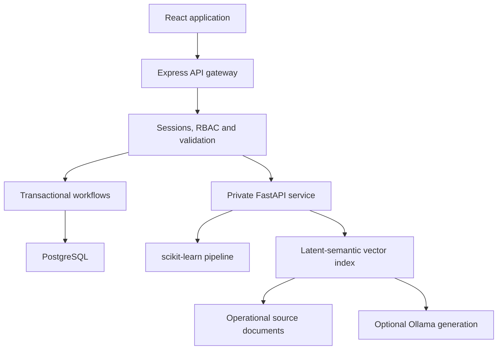
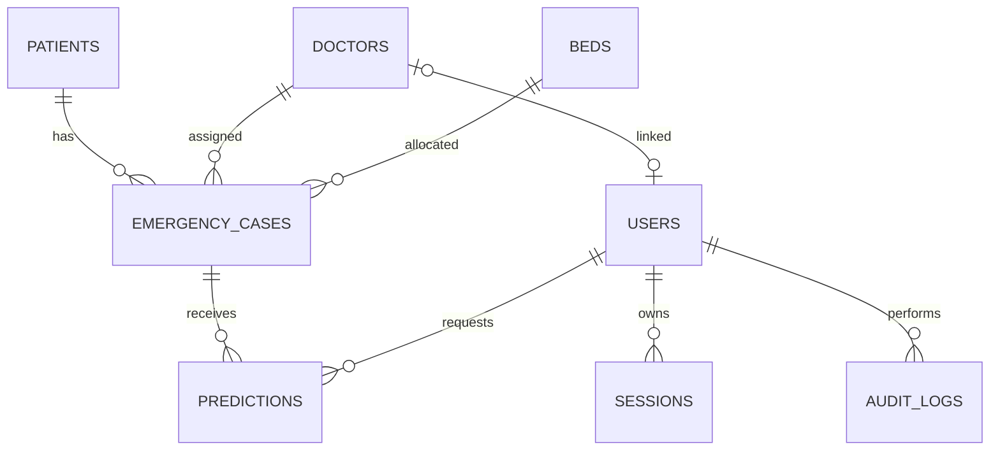

# CareFlow AI

**A clear view of emergency operations, with human-reviewed decision support.**

React + Express + PostgreSQL + FastAPI. An educational portfolio prototype using synthetic records and a reproducible machine-learning experiment. **Not for clinical use, diagnosis, or real patient information.**


## Problem

Patient queues, resource availability and treatment status often sit in separate views. A dashboard alone cannot prevent conflicting assignments, explain how a case progressed, or establish who changed a priority.

## Solution

CareFlow connects registration, resource assignment, treatment and discharge in one transaction-backed workflow. It adds database-derived analytics, a synthetic priority model, explicit human review, and cited operational knowledge retrieval. The existing React/Express/PostgreSQL project was extended; its endpoint paths, entity names and `{success,data}` response convention remain.

## Features

| Module | Implemented behavior |
|---|---|
| Overview | Database counts, actual waiting queue, current beds, arrival chart, periodic refresh |
| Patient directory | Validated registration, edits, delete protections, search, filters, pagination |
| Patient detail | Case history, recorded vitals, timeline, predictions and accessible case activity |
| Emergency operations | Intake, manual resource choices, operational suggestions, guarded transitions |
| Doctors and beds | Administration, availability views, protected assigned resources, explicit bed clearing |
| Analytics | UTC date filters, arrivals, priorities, wait/treatment samples, workload, occupancy and utilization |
| Decision support | Real model inference, model version, local input sensitivity, accept/override/review |
| Knowledge | Document chunks, persistent latent-semantic vectors, cosine retrieval, references, abstention |
| Staff access | Database sessions, four roles, scoped doctor access, staff creation, password change |
| Audit | Transactional event records, administrator viewer, filtered event search |

See [completion status](docs/COMPLETION_STATUS.md), [initial audit](docs/AUDIT.md), and [test evidence](docs/VERIFICATION.md).

## Demo

No live deployment is claimed. The source is prepared for a Docker host. Local verification uses the actual Express and FastAPI processes; the workspace's OS restrictions required the PostgreSQL WASM test adapter. Native PostgreSQL verification is configured in CI and remains a release gate.

The reproducible seed creates **254 synthetic patients/cases, 12 doctors, 20 beds and four accounts**. It creates 240 historical cases and 14 active cases. It refuses to mix demonstration data into an existing patient database. No fixed passwords are published. Account emails are `admin@careflow.demo`, `doctor@careflow.demo`, `nurse@careflow.demo`, and `reception@careflow.demo`; read the generated local credentials after seeding.

## Screenshots

[Emergency operations](docs/screenshots/emergency-desktop.png) · [Analytics](docs/screenshots/analytics-desktop.png) · [Decision support](docs/screenshots/decision-support-desktop.png) · [Knowledge](docs/screenshots/knowledge-desktop.png) · [Mobile overview](docs/screenshots/dashboard-390.png)

## Architecture



The browser talks only to Express. Express serves the production frontend and calls the private Python service. Core operations work if the AI service is unavailable. No Redis, event broker or separate vector database is added for this small workload.

## Technology stack

- **Frontend:** React, JavaScript, Vite, Tailwind CSS, React Router, Lucide icons, Recharts.
- **API:** Node.js, Express 5, `pg`, Zod, Helmet, CORS, express-rate-limit; built-in scrypt password hashing.
- **Database:** PostgreSQL, numbered SQL migrations, transactional audit, partial unique indexes.
- **Data science:** pandas, NumPy, scikit-learn, matplotlib; stratified splits and persisted pipeline.
- **AI service:** FastAPI, Pydantic; TF-IDF + truncated SVD vectors; optional Ollama generation.
- **Verification:** Node test runner, pytest, Playwright; GitHub Actions with PostgreSQL 18.

## Database design

Core tables retain the original names and identifiers. Added fields include created/updated timestamps, workflow stage timestamps and JSONB vitals. `users`, `sessions`, `audit_logs`, `predictions`, `schema_migrations` and `seed_runs` support access, traceability and reproducibility.

### ER diagram



Partial unique indexes prevent multiple active cases using the same patient, doctor or bed. `CHECK` constraints enforce state vocabulary and required resources. Foreign keys protect related history. All SQL values use parameters; dynamic column names come only from fixed allowlists. Existing data is never dropped by the migration; conflicting legacy records stop it with a rollback. Back up and review an existing database before migration.

## Emergency workflow

| Action | Required state | Atomic changes |
|---|---|---|
| Create case | Registered patient, no active case | Waiting case and patient priority/status |
| Assign doctor | Waiting + available doctor | Assigned case, Busy doctor, timestamp |
| Assign bed | Assigned doctor, no existing bed | Occupied bed, patient link, timestamp |
| Start treatment | Assigned doctor and bed | In Treatment, start timestamp |
| Complete treatment | In Treatment | Completed, completion timestamp |
| Discharge | Completed | Discharged, doctor available, bed available and cleared |

Each action locks the case and relevant resource rows, checks current state, updates records, writes an audit event and commits as one transaction. Repeated or out-of-order actions return a conflict. General edit routes cannot free active resources or directly set workflow status. Completed/discharged history cannot be deleted through the case endpoint; deletion is limited to unused waiting cases.

## Analytics

PostgreSQL performs aggregations. Time boundaries are explicit UTC. Wait time means arrival to doctor assignment and excludes still-waiting cases; the sample count is returned. Treatment duration requires both start and completion. Discharges are measured within the selected **arrival cohort**, not by discharge date. Occupancy is a current snapshot; utilization uses overlapping occupied hours and assumes the current bed inventory existed throughout the period. These definitions are visible in the UI and corpus.

## ML pipeline

The generator produces **6,000 artificial adult scenarios** with overlapping class-conditional distributions and missing vital values. Labels are invented categories used to teach ML evaluation. No clinical triage thresholds are asserted. Age is 18–89; no pediatric extrapolation is allowed.

A stratified 70/15/15 split gives 4,200 training, 900 validation and 900 test rows. Median imputation and scaling fit on training data only. Four candidates are compared using validation macro F1. The chosen model is evaluated once on the held-out test partition. The dataset hash, split indices, library versions, EDA, full reports and confusion matrix are saved.

### Actual model evaluation

| Held-out synthetic test metric | Measured result |
|---|---:|
| Selected model | Logistic regression |
| Accuracy | 0.8167 |
| Macro F1 | 0.7893 |
| Weighted F1 | 0.8183 |
| Critical-class recall | 0.7820 |
| Multiclass OVR ROC AUC | 0.9389 |

These measure recovery of the synthetic generator, **not performance on real patients**. See [model card](docs/MODEL_CARD.md), [machine-readable metrics](ml-service/reports/metrics.json), [EDA](ml-service/reports/eda.json), and [evaluation figure](ml-service/reports/evaluation.png).

## AI decision support

Predictions record the input snapshot, pipeline version, timestamp and uncalibrated class scores. No confidence or clinical risk percentage is invented. A local sensitivity probe replaces each feature with its training median and measures the chosen class score change; this is not SHAP or causal attribution.

Only an administrator or the assigned doctor can review a pending prediction. Accept applies the suggestion; override requires a new priority and reason; review records acknowledgement without applying a suggestion. Review affects case and patient priority together. Older predictions cannot supersede newer ones and discharged cases are read-only.

## RAG architecture

Five project-authored CC0 operational documents are split by headings. Each chunk has a stable ID, document path, title, section, license and text. TF-IDF followed by truncated SVD produces dense latent-semantic vectors; the index and metadata are persisted with a content hash. Queries use the same transform and cosine similarity with a minimum threshold.

**Default mode is explicitly retrieval-only:** actual excerpts plus sources. Set `OLLAMA_URL` and `OLLAMA_MODEL` to enable the implemented retrieval-augmented generation path with a real model. That path uses retrieved context, requires source IDs and verbatim supporting quotes, and falls back to excerpts if generation fails or evidence cannot be verified. Quote validation does not prove semantic entailment.

The included 10-query author-written retrieval check measured hit@3 **1.0** and MRR@3 **0.8833**. It is a small development check, not an independent benchmark. The real LLM path is implemented but was not run against a downloaded model in this workspace. Read [knowledge documentation](docs/KNOWLEDGE.md).

## Authentication & RBAC

| Capability | Admin | Doctor | Nurse | Reception |
|---|:---:|:---:|:---:|:---:|
| Patient/case lists | All | Assigned only | All | All |
| Registration/intake | Yes | No | Yes | Yes |
| Allocate doctor/bed | Yes | No | Yes | No |
| Treatment/discharge | Yes | Assigned only | No | No |
| Request prediction | Yes | Assigned only | Yes | No |
| Accept/override/review | Yes | Assigned only | No | No |
| Analytics | Yes | No | Yes | No |
| Staff/audit administration | Yes | No | No | No |

Opaque random session tokens are hashed in PostgreSQL. Cookies are HTTP-only and SameSite Strict, with Secure and `__Host-` naming in production. The anti-CSRF token is held in memory. Password changes revoke sessions. There is no public registration or token storage in localStorage.

## Security

Zod validation, bounded bodies, ID validation, strict write-origin checks, server-side authorization, rate limiting, parameterized SQL, CSP/security headers, generated request IDs, safe errors and secrets ignored by Git. Database SSL verifies certificates when enabled. The Python token stays between servers. Rate limiting is in-process, so multi-replica deployment needs a shared limiter. This is not a medical compliance certification or a security penetration-test claim.

## Testing

```bash
npm ci
npm run install:apps
npm run lint
npm run build
# With a dedicated careflow_test PostgreSQL database and test environment:
npm run migrate --prefix backend
npm run seed --prefix backend
npm run test:api
cd ml-service
python train.py
python evaluate_retrieval.py
python -m pytest -q
```

The API tests reject a database URL that does not contain `careflow_test`. They create synthetic records and must not target a production database. Use [testing instructions](docs/TESTING.md) for full environment and browser commands. [Verification](docs/VERIFICATION.md) distinguishes executed checks from unexecuted release gates.

## Local setup — Docker (recommended)

Requires Docker with Compose, and Python only to generate the environment file.

```bash
python scripts/setup_env.py
docker compose up --build -d
docker compose exec -e DEMO_SEED=true api npm run seed
docker compose exec api cat .demo-credentials
```

Open **http://localhost:5000** and sign in using a generated demo account. The database volume persists across restarts. `docker compose down` keeps data; do not use `down -v` unless you intend to discard it.

For an existing local PostgreSQL installation and Windows PowerShell, see [local setup](docs/LOCAL_SETUP.md). Docker images and hosted production deployment could not be executed inside this workspace; their build/run validation remains a release gate.

## Environment variables

| Variable | Purpose |
|---|---|
| `DATABASE_URL` / legacy `DB_*` | PostgreSQL connection; existing split variables remain supported |
| `APP_ORIGIN` | Exact frontend origin; HTTPS required in production |
| `NODE_ENV` | `development`, `test`, or `production` |
| `ML_SERVICE_URL`, `ML_SERVICE_TOKEN` | Private AI gateway address and authentication |
| `DB_SSL`, `DB_SSL_CA` | Verified TLS and optional provider CA |
| `TRUST_PROXY_HOPS` | Actual reverse-proxy count; no blanket trust |
| `DEMO_SEED`, `DEMO_PASSWORD` | Explicit synthetic seeding and optional generated password |
| `OLLAMA_URL`, `OLLAMA_MODEL` | Optional configured language-model service |

`.env.example` files contain no usable credentials. `python scripts/setup_env.py` creates the root Compose environment without overwriting an existing file.

## Deployment

The root Dockerfile builds React and serves it through Express. The Python image trains its artifact during build. Compose provides a private database, private Python service, health checks and a loopback-bound API port for a host reverse proxy. CI includes native PostgreSQL and browser checks. See [deployment guide](docs/DEPLOYMENT.md).

No cloud hosting account, server or production credentials were supplied, so **there is no production URL** and no hosted validation is claimed.

## API overview

Existing paths are preserved: `/api/patients`, `/api/doctors`, `/api/beds`, `/api/emergency-cases`, `/api/dashboard/stats`. All resource collections support pagination; patient/case search and filtering stay server-side. Patient PATCH is retained and PUT added. New groups are `/auth`, `/users`, `/analytics`, `/audit`, `/ai`, `/knowledge`, `/services`, `/health`, `/ready`.

See [API reference](docs/API.md) for request bodies, role restrictions and workflow paths.

## Project structure

- `frontend/src/`: existing layouts/pages extended with reusable forms, auth, queries and charts.
- `backend/src/`: Express routes, controllers, middleware and transactional services.
- `backend/migrations/`, `backend/scripts/`: schema, seed and administrator bootstrap.
- `backend/tests/`: integration tests and a strictly test-only WASM PostgreSQL adapter.
- `ml-service/app/`: validated inference and knowledge retrieval/generation.
- `ml-service/train.py`, `reports/`, `notebooks/`: reproducible experiment and evidence.
- `scripts/`: environment setup, browser verification and service readiness helper.
- `docs/`: audit, deployment, status, interview guide, resume material and screenshots.

## Limitations and future work

Native PostgreSQL CI, Docker build/run, HTTPS hosting, and real LLM generation remain external validation gates. The model is synthetic and not clinically validated; the corpus is operational only. Doctor scheduling assumes one active assignment per doctor. A larger hospital would need a capacity-aware assignment model, inventory history, secure data governance, measured scaling, centralized rate limiting, audit retention controls, and specialist clinical review. User deactivation and password recovery are not implemented; staff creation and password change are.

## Interview and resume material

[Interview guide](docs/INTERVIEW_GUIDE.md) · [Truthful resume bullets](docs/RESUME.md) · [Demo walkthrough](docs/DEMO.md)

The project can strengthen an application, but no project can guarantee recruiter selection. Use only claims and metrics you can explain and reproduce.
