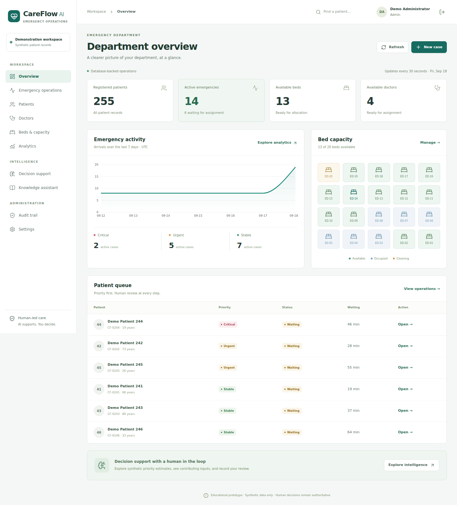

<div align="center">

# 🏥 AegisED

### Intelligent Emergency Operations & Decision-Support Platform

**A production-deployed full-stack platform combining emergency operations, transaction-safe resource allocation, human-reviewed machine learning, analytics, role-based access control, auditability, and grounded knowledge retrieval.**

[](https://careflow-app.onrender.com)


[Live Demo](https://careflow-app.onrender.com) •
[Architecture](#-system-architecture) •
[ML System](#-human-in-the-loop-ml-decision-support) •
[Security](#-security--access-control) •
[Deployment](#-production-deployment)

</div>

---

> [!IMPORTANT]
> **Responsible AI:** AegisED is an engineering and educational demonstration. Its machine-learning subsystem is evaluated on synthetic scenarios and is **not clinically validated** or intended for autonomous diagnosis, triage, or medical decision-making.

## 🚀 Live Production Demo

### **[Launch AegisED →](https://careflow-app.onrender.com)**

AegisED is deployed using **Render + Neon PostgreSQL**, with a separately deployed **FastAPI ML service**.

The production environment demonstrates the complete workflow from patient registration and emergency intake through human-reviewed decision support, doctor/bed allocation, treatment, discharge, analytics, and auditability.

> Free hosting may require a short cold start after a period of inactivity.

---

## ✨ Why AegisED?

Many portfolio healthcare applications stop at CRUD operations and static dashboards.

AegisED explores the engineering challenges behind a more complete operational system:

- 🚑 End-to-end emergency workflow management
- 🔒 Transaction-safe doctor and bed allocation
- 👥 Backend-enforced role-based access control
- 🧠 Human-in-the-loop ML decision support
- 🔍 Explainable recommendation review and override
- 📚 Grounded knowledge retrieval with source attribution
- 📊 Database-driven operational analytics
- 📝 End-to-end audit logging
- 🐳 Containerized application architecture
- ☁️ Multi-service cloud deployment

---

## 🖥️ Product Preview

> Add `docs/screenshots/dashboard-desktop.png` using the screenshot instructions below.

<p align="center">
  
</p>

---

## 🏗️ System Architecture

```text
                              USER
                               │
                               │ HTTPS
                               ▼
                   ┌─────────────────────────┐
                   │     React Frontend      │
                   │      Tailwind CSS       │
                   └────────────┬────────────┘
                                │
                                ▼
                   ┌─────────────────────────┐
                   │    Express API Layer    │
                   │                         │
                   │ Auth • RBAC • Audit     │
                   │ Validation • Workflows  │
                   └─────────┬───────┬───────┘
                             │       │
                ┌────────────┘       └──────────────┐
                ▼                                   ▼
     ┌─────────────────────┐              ┌─────────────────────┐
     │   Neon PostgreSQL   │              │   FastAPI ML        │
     │                     │              │   Service           │
     │ • Patients          │              │                     │
     │ • Emergency Cases   │              │ • scikit-learn      │
     │ • Doctors / Beds    │              │ • Prediction API    │
     │ • Users / Sessions  │              │ • Model metadata    │
     │ • Audit Logs        │              │ • Evaluation        │
     └─────────────────────┘              └─────────────────────┘
```

### Why this architecture?

The browser does not communicate directly with PostgreSQL or the ML service.

**Express acts as the application gateway**, centralizing authentication, authorization, validation, auditing, workflow rules, and access to internal services.

This keeps security-sensitive and operational logic on the server rather than trusting the browser.

---

## 🚑 End-to-End Emergency Workflow

```text
Patient Registration
        │
        ▼
Emergency Intake
        │
        ▼
ML Decision Support
        │
        ▼
Human Review
        │
        ▼
Doctor Assignment
        │
        ▼
Bed Assignment
        │
        ▼
Treatment Started
        │
        ▼
Treatment Completed
        │
        ▼
Patient Discharged
        │
        ▼
Doctor + Bed Released
```

The workflow is database-backed rather than simulated with frontend state.

---

## 🔒 Transaction-Safe Resource Allocation

Doctor and bed assignment can create race conditions when multiple users operate concurrently.

AegisED protects these operations with PostgreSQL transactions and row-level locking.

```text
BEGIN
   │
   ▼
SELECT ... FOR UPDATE
   │
   ▼
Validate Resource Availability
   │
   ▼
Update Emergency Case
   │
   ▼
Update Doctor / Bed
   │
   ▼
Write Audit Event
   │
   ▼
COMMIT
```

If an operation fails, the transaction is rolled back so the emergency case and resource state remain consistent.

This prevents concurrent requests from successfully assigning the same resource.

---

## 🧠 Human-in-the-Loop ML Decision Support

AegisED's ML subsystem provides **assistive recommendations**, not autonomous decisions.

```text
Patient Features
       │
       ▼
ML Pipeline
       │
       ▼
Recommendation
       │
       ▼
Human Review
   ┌───────┼────────┐
   ▼       ▼        ▼
 Accept  Review  Override
                    │
                    ▼
              Reason Required
                    │
                    ▼
                 Audit Log
```

### Model Evaluation

| Metric | Held-Out Synthetic Test Result |
|---|---:|
| Accuracy | **0.8167** |
| Macro F1 | **0.7893** |
| Weighted F1 | **0.8183** |
| Critical Recall | **0.7820** |
| ROC-AUC | **0.9389** |
| Log Loss | **0.4209** |

### Dataset

| Split | Synthetic Scenarios |
|---|---:|
| Training | 4,200 |
| Validation | 900 |
| Test | 900 |
| **Total** | **6,000** |

Four candidate approaches were compared, with the final model selected using validation performance before held-out test evaluation.

> These metrics demonstrate the ML engineering and evaluation pipeline on **synthetic engineering-demo data**. They do not establish clinical validity.

---

## 📚 Grounded Knowledge Assistant

AegisED includes an operational knowledge retrieval subsystem designed to ground answers in indexed source material.

```text
Trusted Documents
       │
       ▼
Chunking + Metadata
       │
       ▼
TF-IDF
       │
       ▼
Truncated SVD
       │
       ▼
Semantic Representation
       │
       ▼
Cosine Similarity
       │
       ▼
Relevance Threshold
       │
       ▼
Retrieved Evidence
       │
       ├──────────────► Source Attribution
       │
       ▼
Grounded Response

Insufficient Evidence ─────────► Abstain
```

### Reliability Features

- Evidence-grounded retrieval
- Source attribution
- Relevance thresholding
- Abstention when supporting evidence is insufficient
- Optional generation layer

---

## 🔐 Security & Access Control

Authorization is enforced by the backend rather than relying only on hidden frontend controls.

### Security Controls

- Backend-enforced RBAC
- Server-side session management
- HttpOnly authentication cookies
- Password hashing
- Request validation
- Parameterized SQL
- Security headers
- Rate limiting
- Environment-based secret management
- Audit logging
- Transactional database operations

### Application Roles

| Role | Primary Scope |
|---|---|
| **Administrator** | System oversight and administration |
| **Doctor** | Clinical workflow interactions |
| **Nurse** | Emergency operational workflow |
| **Reception** | Patient registration and intake |

---

## 📊 Operational Analytics

AegisED derives analytics from application/database data rather than hard-coded dashboard values.

The analytics layer can surface operational information such as:

- Active emergency cases
- Priority distribution
- Bed utilization
- Doctor availability
- Workflow status
- Historical case activity
- Operational trends

---

## 📝 Auditability

Important operational actions generate audit events.

Examples include:

```text
CASE_CREATED
DOCTOR_ASSIGNED
BED_ASSIGNED
TREATMENT_STARTED
TREATMENT_COMPLETED
PATIENT_DISCHARGED
AI_REVIEWED
```

This provides traceability across the emergency workflow.

---

## 🧪 Testing & Validation

AegisED is validated across multiple layers instead of relying only on manual UI testing.

| Layer | Validation |
|---|---|
| Frontend | Lint + production build |
| Backend | API integration testing |
| ML / Retrieval | Python tests |
| Browser | End-to-end workflow validation |
| Responsive UI | Desktop, tablet and mobile |
| Database | Migration + transaction workflow |
| Authentication | Login + RBAC validation |
| AI | Decision-support integration |
| Knowledge | Citation + abstention checks |
| Production | Render + Neon integration |

The production workflow has been exercised from registration through discharge, including doctor and bed release.

---

## ☁️ Production Deployment

```text
                          INTERNET
                             │
                             ▼
                    Render Web Service
                     React + Express
                      /           \
                     /             \
                    ▼               ▼
           Neon PostgreSQL     Render ML Service
                                FastAPI
                                   │
                                   ▼
                              scikit-learn
```

### Production Stack

| Component | Technology / Platform |
|---|---|
| Frontend | React + Tailwind CSS |
| Backend | Node.js + Express |
| Database | PostgreSQL on Neon |
| ML API | FastAPI |
| ML | scikit-learn |
| Web Hosting | Render |
| ML Hosting | Render |
| Containers | Docker |

### Live Application

**https://careflow-app.onrender.com**

---

## 🐳 Local Development

### Prerequisites

- Node.js 22+
- Python 3.12+
- PostgreSQL
- Docker / Docker Compose (recommended)

Clone the repository:

```bash
git clone https://github.com/YT-PRO12/AegisED-AI.git
cd AegisED-AI
```

Environment templates are provided through `.env.example` files.

**Never commit real passwords, tokens, production database URLs, or generated demo credentials.**

Refer to the repository documentation for environment-specific setup and testing instructions.

---

## 📁 Repository Structure

```text
AegisED-AI/
│
├── frontend/                 # React user interface
│
├── backend/
│   ├── src/                  # Express API and business logic
│   ├── migrations/           # PostgreSQL migrations
│   ├── scripts/              # Migration / administration tooling
│   └── tests/                # API tests
│
├── ml-service/               # FastAPI ML + retrieval service
│
├── docs/                     # Architecture/testing documentation
│   └── screenshots/          # Product screenshots
│
├── scripts/                  # Project-level tooling
│
├── Dockerfile
├── docker-compose.yml
└── README.md
```

---

## ⚙️ Engineering Decisions

### Why PostgreSQL?

The application contains strongly related entities—patients, emergency cases, doctors, beds, users and audit records—and requires transactional consistency during resource allocation.

### Why keep Express between React and ML?

It prevents the browser from becoming responsible for internal-service authentication and keeps authorization, validation and auditing centralized.

### Why human-reviewed ML?

Decision support is more defensible when recommendations remain reviewable and overridable rather than being treated as authoritative decisions.

### Why not add Kafka, Redis or Kubernetes?

The current workload does not justify their operational complexity. The architecture favors technologies that solve demonstrated requirements rather than adding infrastructure solely for appearance.

---

## ⚠️ Scope & Limitations

AegisED is a portfolio and engineering demonstration.

- Synthetic data is used for ML evaluation and demo workflows.
- The ML system is not clinically validated.
- The platform must not be used for real medical decision-making.
- No real patient PII should be entered into the public demo.
- Free-tier cloud services may experience cold starts.
- Production healthcare deployment would require substantially stronger regulatory, privacy, security, reliability and clinical validation work.

---

## 🛣️ Future Engineering Work

Potential extensions include:

- More comprehensive integration and load testing
- Production-grade observability
- Expanded model monitoring
- Model/data drift detection
- Stronger deployment automation
- Broader trusted knowledge corpora
- Additional operational analytics
- Formal privacy and compliance architecture

---

## 👨‍💻 Author

**Yatharth Goyal**

B.Tech — Information Technology

[GitHub](https://github.com/YT-PRO12)

---

<div align="center">

### Built to explore full-stack engineering, reliable AI integration, database concurrency and responsible decision support.

**[🚀 Launch AegisED](https://careflow-app.onrender.com)**

</div>

