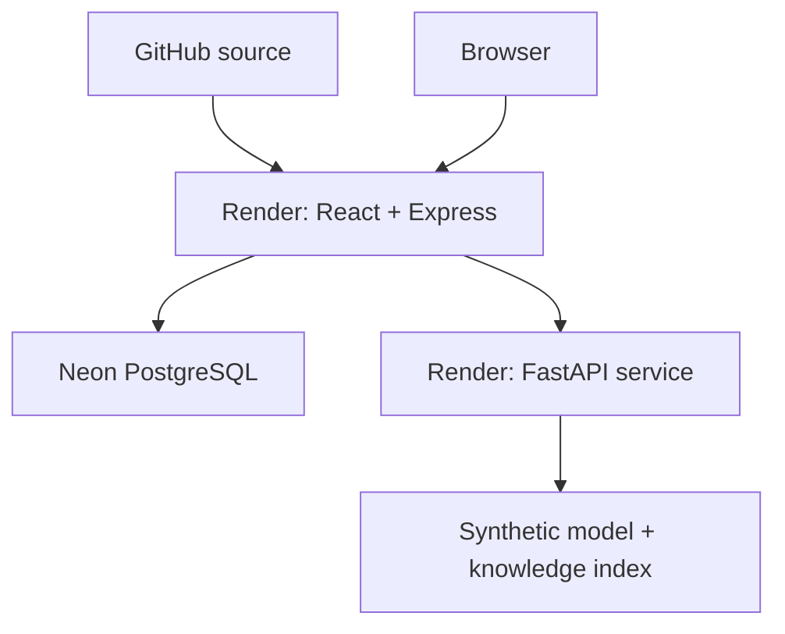

# Production deployment and operations

## Current production

**[AegisED on Render](https://AegisED-app.onrender.com)** is the current portfolio application. The operator identifies the database as **Neon PostgreSQL** and the separate ML deployment as **Render FastAPI**. The main service serves the React bundle and Express API from one origin. Provider configuration and credentials are not stored in this repository.

The 2026-09-20 review directly observed the HTTPS login page, `/api/health` and `/api/ready`. GitHub's successful `production` deployment record points to Render. These observations establish public reachability and database readiness, not a complete authenticated production regression. See [release evidence and limits](RELEASE_READINESS.md).



Render owns the public TLS endpoint. Express owns application sessions, CSRF protection, authorization and workflow transactions. It calls Python server-to-server with `X-Service-Token`; the browser never receives that token. Whether the ML endpoint uses a Render private address or a protected public address must be confirmed in the owner-controlled service settings. No ML service URL is guessed or published here.

## Existing deployment files

The working root Dockerfile, Python Dockerfile and `compose.yaml` are preserved. The Node image builds React and serves it through Express, runs as `node`, and applies migrations before startup. The Python image runs as a non-root user and generates the reproducible synthetic artifact during a fresh image build. This review reused the existing model and did not rebuild or redeploy either service.

A Render deployment's actual build/start settings must be read in its dashboard; the presence of Dockerfiles alone does not prove which deployment mode is selected. Keep the current working settings unless a reproduced defect requires changing them. The Compose stack is for local or separately authorized Docker-host use and is not the production Neon database.

## Configuration responsibilities

| Setting | Main application | Python service |
|---|---|---|
| `NODE_ENV` | `production` | `production` |
| `APP_ORIGIN` | Exact public origin: `https://AegisED-app.onrender.com` | Not used |
| `DATABASE_URL` | Neon connection string, secret environment value | Not used |
| `DB_SSL`, `DB_SSL_CA` | Verified TLS/CA as required by the provider; do not disable certificate verification | Not used |
| `ML_SERVICE_URL` | Actual reachable Render ML address, set privately | Not used |
| `ML_SERVICE_TOKEN` | Private shared service token | Same token |
| `TRUST_PROXY_HOPS` | The actual trusted proxy count; retain the known working setting | Not used |
| `PORT` | Express reads the host-provided port | Preserve the working Render start command; Docker default is 8000 |
| `OLLAMA_URL`, `OLLAMA_MODEL` | Not used | Optional only when a real model service is configured |

Do not paste secret values into issues, screenshots, README files or shell histories. Never disable TLS verification to work around a connection problem. The deployed cookie uses `Secure`, `HttpOnly`, `SameSite=Strict` and a `__Host-` name; HTTPS is required. Check these properties with an authorized login before the release smoke test is signed off.

## Safe maintenance and validation

1. Review the exact source commit and its GitHub Actions result. The successful run recorded in the release review applies to the inspected baseline commit; the new release commit needs its own run.
2. Confirm the Render main and ML services are healthy. `/api/ready` verifies a database query, but does not verify Python. An authorized administrator can inspect `/api/services` or the Settings service view.
3. Use an authorized synthetic demo account to check login/logout, route refresh, dashboard, analytics, role restrictions, model inference/review, and cited knowledge responses. Do not post credentials publicly.
4. Run mutating intake/assignment/discharge tests in a disposable local/staging database, or only against specifically agreed disposable production records. The repository browser script creates records and is not a public production smoke test.
5. Back up a populated database before a schema change, verify the migration on a restored copy, and retain the prior deployable commit. Reverting code does not reverse a database migration.
6. Confirm backup/restore, logging and service restart behavior in the owner-controlled environment. This review did not perform those operations.

A Render cold-start page was observed during the public check. Allow the service to finish waking before diagnosing a blank or slow first request as an application defect. No performance or uptime guarantee is inferred from one visit.

## Historical provider records

Railway is obsolete for this project. No Railway deployment file or current infrastructure reference was found in the source. GitHub still returned an old `clever-celebration / production` deployment record whose latest state was **inactive**; the Render `production` record was **success**. This is retained as historical metadata, not current infrastructure. No remote environment, integration or deployment record was deleted by this review. The owner may confirm that an obsolete integration cannot create new statuses, if desired.

## Optional local Docker validation

```bash
python scripts/setup_env.py
docker compose config --quiet
docker compose build
docker compose up -d
docker compose exec -e DEMO_SEED=true api npm run seed
docker compose exec api cat .demo-credentials
```

Open `http://localhost:5000`. The generated environment and credentials stay local. Restart and check data persistence. `docker compose down` retains the database volume; `down -v` discards it and should only be used intentionally on disposable data. Docker execution was not available in this release-review workspace.

## Operational limitations

Rate limits are process-local; multiple API replicas need a shared limiter. Sessions are already stored in PostgreSQL. Database administrators can alter audit records; they are not a tamper-proof ledger. Staff deactivation/password recovery, production load testing, alerting, retention policies and backup/restore drills remain outside this prototype. The app uses synthetic data and does not establish clinical validity or regulatory compliance. Real Ollama generation remains optional and unverified in this review.

