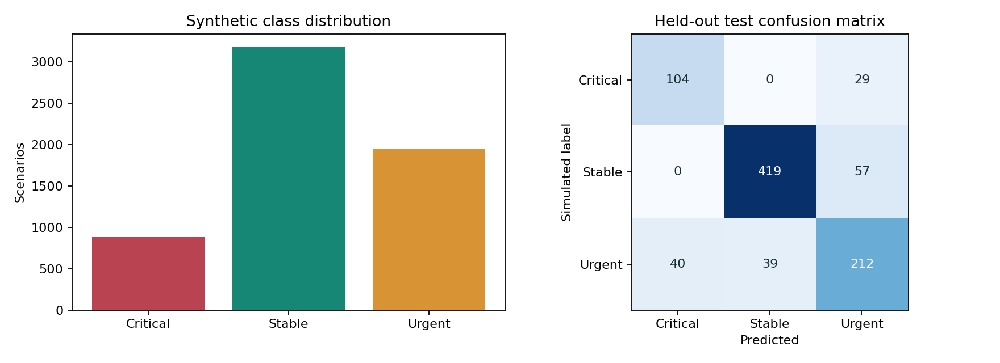

# Synthetic priority model card

## Intended use

Demonstrating an end-to-end, auditable ML workflow in a portfolio. Not clinical triage, diagnosis, treatment selection, or a prediction of patient outcomes.

## Dataset and provenance

`app/dataset.py` creates 6,000 artificial adults. A seeded class draw uses Stable/Urgent/Critical proportions 0.52/0.33/0.15. Each label controls overlapping invented vital-sign distributions. Age is independent, 18–89 inclusive. Missingness is independently introduced to vital fields at approximately 3.5%. The distributions are arbitrary educational choices, not thresholds or guidance. There are no real patient identities or external data licenses to infer. The report stores the exact SHA-256 of the generated CSV.

This simulation makes the task partly circular: train and test share the same generator. Good metrics establish recovery of invented associations only. They provide no evidence of real-world generalization, medical validity, subgroup equity, or probability calibration.

## Preparation and evaluation

Invalid values are clipped within the generator's declared bounds. Missing values are analyzed in EDA. Split indices are stratified and reproducible with seed 42. No preprocessing is fitted before splitting. `SimpleImputer(strategy='median')` and `StandardScaler` fit within each model pipeline on 4,200 training rows; 900 validation rows select the model by macro F1; 900 held-out rows produce the final report. The selected pipeline is not refitted on validation data.

Candidates: majority baseline, balanced logistic regression, depth-limited balanced decision tree, and balanced random forest. Logistic regression won the validation comparison. Read `ml-service/reports/metrics.json` for all candidate scores and per-class metrics rather than assuming the most complex model is best.

## Measured results

- Accuracy: 0.8166667
- Macro F1: 0.7893277
- Weighted F1: 0.8182505
- Multiclass OVR macro ROC AUC: 0.9388616
- Log loss: 0.4208975
- Critical precision/recall/F1: 0.7222 / 0.7820 / 0.7509 (133 test examples)
- Stable precision/recall/F1: 0.9148 / 0.8803 / 0.8972 (476 examples)
- Urgent precision/recall/F1: 0.7114 / 0.7285 / 0.7199 (291 examples)



## Serving and explanations

The API accepts age plus five complete vital fields with numeric bounds. It rejects children and adults outside the synthetic age range. Probabilities are reported as uncalibrated class scores; they are not displayed as confidence or clinical risk. A per-input median replacement probe is a sensitivity analysis, not causality or SHAP. Global permutation importance is computed on validation data and retained in the report.

## Human review

Inference does not change case priority. Predictions persist input snapshots, model version and output. Authorized reviewers may accept, override with rationale, or acknowledge without changing priority. The latest pending prediction is the only one eligible for review. Decisions and workflow updates are recorded transactionally.

## Reproduce

```bash
cd ml-service
python -m pip install -r requirements.txt
python train.py
python -m pytest -q
```

`reports/eda.json` contains missingness-related summaries, duplicate count, numeric distributions and correlations. `reports/splits.npz` stores partition indices. `notebooks/01_explore.ipynb` provides an interactive entry point. Floating-point details may vary across platforms; versions and seed are recorded.
